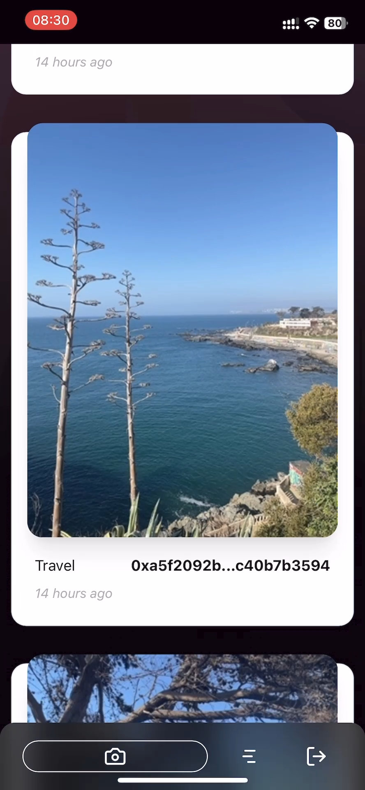
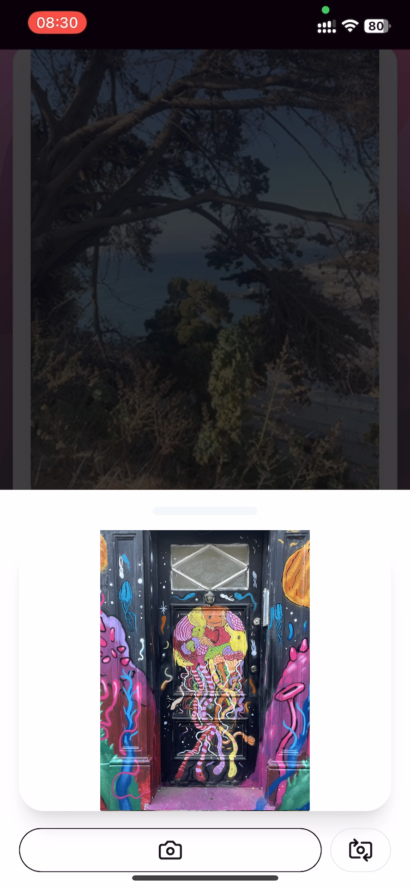

# Build a PWA with Irys and Privy


This is a demo app that teaches how to use [Privy](https://www.privy.io/) and [Irys](https://irys.xyz/) to create a mobile photo-sharing app packaged as a Progressive Web App (PWA).

In the app users can:

- Login with Privy
- Install on their home screens
- Take a photo with front or back cameras
- Categorize the photo
- Permanently upload the photo using the [Irys SDK](https://docs.irys.xyz/developer-docs/irys-sdk)
- View categorized photo feeds generated using the [Irys query package](https://docs.irys.xyz/developer-docs/querying/query-package)

The app is a fork of the [Privy NextJS template](https://github.com/privy-io/create-next-app), and is packaged as a PWA for mobile delivery.

## Setup

1. Clone this repository and open it in your terminal.

1. Install the necessary dependencies

```sh
npm install
```

3. Initialize your environment variables by copying the `.env.example` file to an `.env.local` file. Then, in `.env.local`, [paste your Privy App ID from the console](https://docs.privy.io/guide/console/api-keys).

```sh
# In your terminal, create .env.local from .env.example
cp .env.example .env.local

# Add your Privy App ID to .env.local
NEXT_PUBLIC_PRIVY_APP_ID=<your-privy-app-id>
```

## Building locally

In your project directory, run `npm run dev`. You can now visit http://localhost:3000 to see your app and login with Privy!

## Irys


[Irys](https://irys.xyz/) is a provenance layer built on top of [Arweave](https://arweave.org/). In this app, photos are uploaded to Irys, given a millisecond accurate timestamp and then stored permanently on Arweave.

### Cost to upload

Irys has a pay-once, store-forever model. You pay a fee at upload time and your data is guaranteed to be retrievable forever.

> For more information on how this fee model works, [check out our FAQ](https://docs.irys.xyz/faqs/dev-faq#how-does-the-arweave-endowment-help-ensure-data-permanence).

Uploads under 100 Kib are free, and to reduce friction in this demo app images are resized to ~90Kib before uploading.

### Uploading

To upload data to Irys, you:

```js
// 1. Connect to a node
const irys = new Irys({ network, token, key });
// 2. Fund the node
const fundTx = await irys.fund(irys.utils.toAtomic(0.05));
// 3. Upload
const receipt = await irys.uploadFile("./myImage.png");
```

### Tagging

Irys supports [adding metadata tags to your upload](https://docs.irys.xyz/developer-docs/tags), these tags are indexed and are queryable. In this app, we first create an array of tags, and then pass those tags to the function `webIrys.uploadFile()` when uploading our image.

```js
const tags = [
	{ name: "Content-Type", value: "image/jpeg" },
	{ name: "application-id", value: process.env.NEXT_PUBLIC_APP_ID },
	{ name: "category", value: category },
];
const receipt = await webIrys.uploadFile(imageFile, { tags });
console.log("🚀 ~ receipt:", receipt);
console.log(`Data uploaded ==> https://gateway.irys.xyz/${receipt.id}`);
```

### Querying

Uploads to Irys are queryable using [GraphQL](https://docs.irys.xyz/developer-docs/querying/graphql) and the [Irys query package](https://docs.irys.xyz/developer-docs/querying/query-package). In our app, we query based on the application ID and content type, and then do client-side filtering based on categories.

```js
const myQuery = new Query({ url: `https://node2.irys.xyz/graphql` });
const TAGS_TO_FILTER = [
	{ name: "application-id", values: [process.env.NEXT_PUBLIC_APP_ID] },
	{ name: "Content-Type", values: ["image/jpeg"] },
];

const results = await myQuery
	.search("irys:transactions")
	.fields({
		id: true,
		address: true,
		timestamp: true,
		tags: {
			name: true,
			value: true,
		},
	})
	.tags(TAGS_TO_FILTER)
	.sort("DESC");
```

### Irys functions

All Irys functions are contained in `utils/irysFunctions.ts`.

- `getWebIrys`: Connects to an Irys node using the injected provider from Privy
- `uploadImage`: Permanently uploads an image
- `fetchImages`: Uses the [Irys Query package](https://docs.irys.xyz/developer-docs/querying/query-package) to retrieve uploaded images
- `resizeImage`: Resizes the image to be <100Kib

**Check out [Irys docs](https://docs.irys.xyz/) for more guidance around using Irys in your app!**

## Privy functions

- `pages/_app.tsx` for how to use the `PrivyProvider` and initialize it with your Privy App ID
- `pages/index.tsx` for how to use the `usePrivy` hook and implement a simple `login` button
- `pages/dashboard.tsx` for how to use the `usePrivy` hook, fields like `ready`, `authenticated`, and `user`, and methods like `linkWallet` and `logout`

**Check out [Privy docs](https://docs.privy.io/) for more guidance around using Privy in your app!**

## Screens




